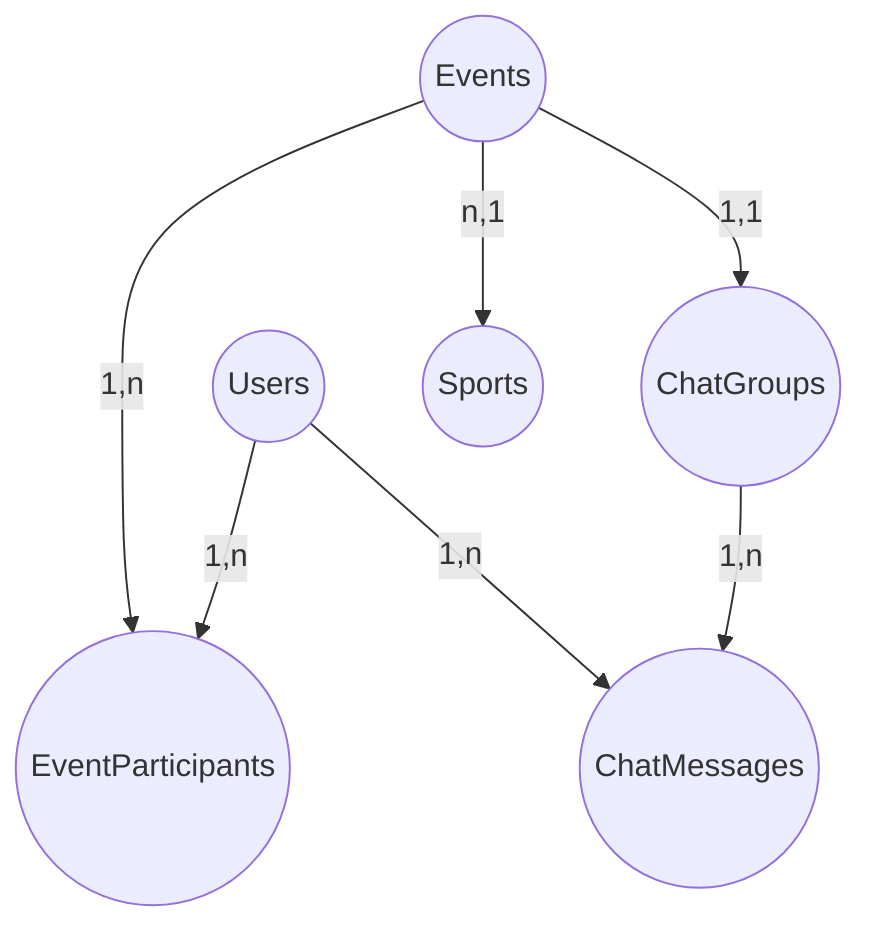

# SportMatchy

SportMatchy est une plateforme web de rencontre sportive développée 

## Présentation

Ce projet a été réalisé par des mokhtar derbazi et tadjer abdelkrim pour le projet de WEB unice (PHP, JS, MySQL, WebSocket, etc). Il permet de :
- Créer et rejoindre des événements sportifs
- Discuter en groupe via un chat en temps réel
- Visualiser les événements sur une carte et dans un calendrier
- Gérer son profil et ses préférences sportives

<!-- **Remarque :** Ce projet n'est pas une application de production parfaite, mais une base pédagogique pour progresser en développement web. -->

## Fonctionnalités principales
- Inscription et connexion utilisateur
- Création et gestion d'événements sportifs
- Chat de groupe en temps réel (WebSocket)
- Carte des événements (Google Maps)
- list des resulats des matches foot lives
- Calendrier des événements (FullCalendar)
- Mode sombre

## Diagramme des entités principales

## Installation rapide

1. Cloner le répôt
2. Importer le fichier `database.sql` dans MySQL
3. Configurer la base de données dans `includes/config.php`
4. Lancer le serveur PHP et le serveur WebSocket
5. Accéder à `index.php` dans le navigateur

## Auteurs
- Mokhtar (sh0z3n)
- Abdelkrim

Projet réalisé dans le cadre d'un cours universitaire L22 . Pour toute question, contactez-nous !
